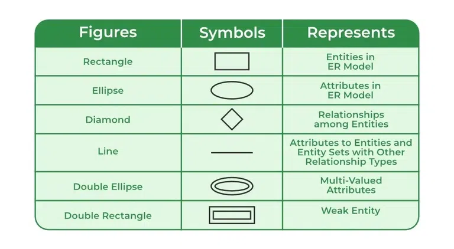

# Module 1: Big Data and Basic Data Concepts
### M1U1L1 Intro to Data and Data Processing
1. data comes from: internet, sensor, etc.
2. data > Processing > useful information
3. bit data: big volume, keeps growing, and comes from a variety
of sources and format. (volume, velocity and variety)
4. data processing systems:
    1. Relational DBMS
    2. NoSQL
    3. Hadoop, Spark: map reduce

<br/>

### M1U2L1 Database Management Systems
1. DBMS: models real-world
    1. entities
    2. relationships
2. Benefits of DBMS
    1. Data independence: you don't have to worry about how it works
    2. Data administration
    3. Efficient data access
    4. Data integrity and security
    5. Concurrent access and crash recovery
    6. Reduced app development time
### M1U2L2 Data Models
1. Data model: collection of concepts for describing data
2. Schema架構: description of a particular collection of data, using given data model
3. Relational model of data
    1. shown through the table with rows and columns
    2. relation
    |Schema1|Schema2|
    |------|------|
    |Attribute|Attribute|
    |Attribute|Attribute|
4. Levels of abstraction
    1. many views: what user see
    2. single conceptual/logical schema: developer design
    3. single physical schema: DBMS controls

### M1U3L1 Entity Relationship Model ER
1. Database design
    1. requirement analysis
    2. conceptual database design: Build ER diagram
    3. logical database design: Convert ER diagram/design into a relational database schema
2. Conceptual design
    1. What are the entities and relationships
    2. What data should we store
    3. What are the constraints or rules
    4. Can map of an ER diagram into a relational schema
3. ER Model Basics
    1. Entity (e.g., an employee)
    2. Attributes (used to describe entity)
    3. Entity Set (e.g., all employees)
        1. all entities in a set have the same set of attributes
        2. each entity has a key
        3. each attribute has a domain (range)
    4. relationship: association among two or more entities
    5. relationship set
    6. key constraint: 1-to-1, 1-to-many, many-to-1, many-to-many (描述實體之間的關係)
    7. participation constraints (描述兩個集合中的實體是否一定要有關係)
        1. Total participation: Each entity in the entity set must participate in the relationship.
        2. Partial participation
    8. Weak Entities (描述一個集合無法獨立存在 (因為它自身沒有primary key)，必須要有和另一個實體有完全參與關係)
        1. A weak entity can be identified uniquely only by considering the primary key of another (owner) entity.
        2. Weak entity set must have a total participation in a relationship set
4. ER Model Symbols https://www.geeksforgeeks.org/introduction-of-er-model



### M1U3L2 Class Hierarchies and Aggregation within ER Models
1. Class hierarchies
    1.  attributes can be inherited
    2. `A ISA B` every A entity is also considered to be a B entity
        1. e.g., `Hourly_Employees ISA Employees` `Contract_Employees ISA Employees`
        2. `Employees` is a superclass
        3. `Hourly_Employees` is a subclass of `Employees`, `Contract_Employees` is also a subclass of `Employees`
    3. overlap constraints: an entity can be in multiple subclass (e.g. `Employee Dan` can be a `Hourly_Employees` and `Contract_Employees` at the same time) 
    4. covering constraints: an entity must be in one of the subclass (e.g. if `Employee Dan` is a `Hourly_Employees`, he cannot be a `Contract_Employees`)
2. Aggregation: treat a relationship set as an entity set for purposes of participation in (other) relationships

### M1U3L3 Creating Relations in SQL
1. Relational database
    1. instance: a table with rows and columns 
    2. schema: specifies name of relation (name, type)
    3. cardinality: number of rows
    4. degree: number of columns
    5. type/domain
2. Basic SQL command
```sql
-- CREATE TABLE
CREATE TABLE Students
(sid: CHAR(20),
name: CHAR(20),
login: CHAR(20),
age: INTEGER,
gpa: REAL);
-- DROP TABLE
DROP TABLE Students;
-- ALTER TABLE
ALTER TABLE Students
ADD COLUMN first Year: integer;
-- INSERT
INSERT INTO Students (sid, name, login, age, gpa)
VALUES (53688, ‘Smith’, ‘smith@ee’, 18, 3.2);
-- DELETE
DELETE
FROM Students S
WHERE S.name = ‘Smith’
```
3. Integrity Constraints
    1. condition that must be true
    2. specified when schema is defined
    3. checked when relations are modified
    4. A legal instance of a relation is one that satisfied all specified ICs.
4. Primary Key Constraints
    1. No two distinct tuples can have same values in all key fields (columns) (these key fields call candidate keys)
    2. if not, use super key (combine 2 or more fields/columns)
    3. chose one of the candidate keys to be a Primary Key
```sql
-- Super key
CREATE TABLE Enrolled
(sid CHAR(20),
cid CHAR(20),
grade CHAR(2),
PRIMARY KEY (sid, cid))

-- Primary key and Candidate keys
CREATE TABLE Enrolled
(sid CHAR(20),
cid CHAR(20),
grade CHAR(2),
PRIMARY KEY (sid),
UNIQUE (cid, grade)); -- (cid, grade) must also have no same values in these fields
```

5. Referential Integrity
    1. Foreign Keys: Set of fields in one relation that is used to refer to a tuple in another relation (another relation's primary key)
    2. Foreign Keys must exist in another relation to enforce referential integrity
    3. if the relation Foreign Keys point to is deleted
        1. delete tuples that refer to it
        2. or, disallow deletion before deleting tuples that refer to it
        3. or, set Foreign Keys' value to default
```sql
CREATE TABLE Enrolled
(sid: CHAR(20),
cid: CHAR(20),
grade: CHAR(2),
PRIMARY KEY (sid, cid),
FOREIGN KEY (sid) REFERENCES Students
ON DELETE CASCADE
ON UPDATE SET DEFAULT);
```


### M1U3L4 ER to Relational Model
1. Translating relationship set in a ER Diagrams to a relation
    1. use foreign keys to form a super key
    2. descriptive attributes
```sql
CREATE TABLE Works_In(
ssn CHAR(11),
did INTEGER,
since DATE,
PRIMARY KEY (ssn, did),
FOREIGN KEY (ssn)
REFERENCES Employees,
FOREIGN KEY (did)
REFERENCES Departments);
```
2. Translating ER Diagrams with Key Constraints
    1. set a single Primary Key in relationship
    2. or, combine a relation into relationship
```sql
CREATE TABLE Manages(
ssn CHAR(11),
did INTEGER,
since DATE,
PRIMARY KEY (did),
FOREIGN KEY (ssn) REFERENCES Employees,
FOREIGN KEY (did) REFERENCES Departments);
```
```sql
CREATE TABLE Dept_Mgr(
did INTEGER,
dname CHAR(20)
budget REAL,
ssn CHAR(11),
since DATE,
PRIMARY KEY (did),
FOREIGN KEY (ssn) REFERENCES Employees);
```

3. Translating ER Diagrams with Participation Constraints
    1. using NOT NULL
```sql
CREATE TABLE Dept_Mgr(
did INTEGER,
dname CHAR(20),
budget REAL,
ssn CHAR(11) NOT NULL,
since DATE,
PRIMARY KEY (did),
FOREIGN KEY (ssn) REFERENCES Employees,
ON DELETE NO ACTION);
```

4. Weak Entity
    1. A weak entity can be identified uniquely only by considering the primary key of another (owner) entity
```sql
CREATE TABLE Dept_Policy(
pname CHAR(20),
age INTEGER,
cost REAL,
ssn CHAR(11) NOT NULL,
PRIMARY KEY (pname.ssn),
FOREIGN KEY (ssn) REFERENCES Employees,
ON DELETE CASCADE);
```